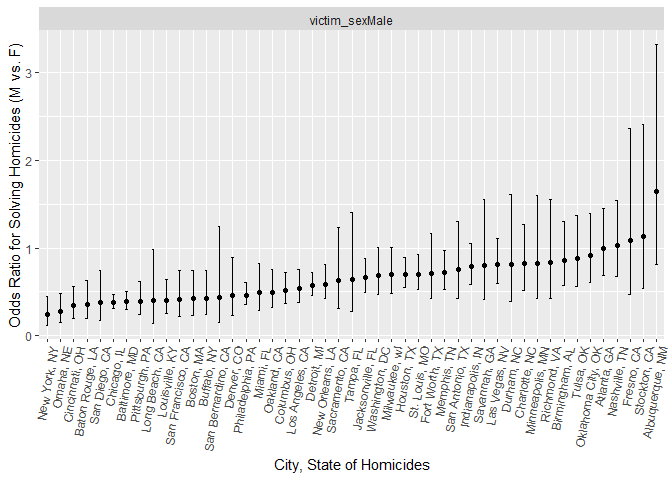
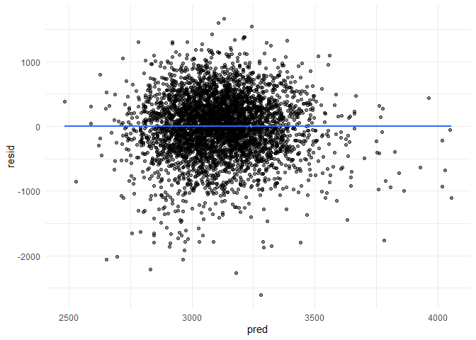
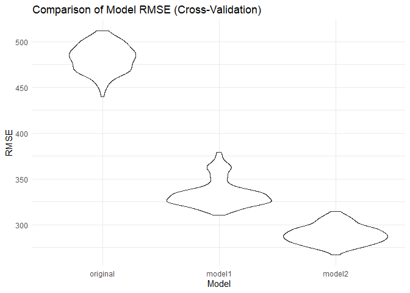

Homework 6: Linear Models
================

## Problem 2

``` r
library(rvest)
library(tidyverse)
```

    ## ── Attaching core tidyverse packages ──────────────────────── tidyverse 2.0.0 ──
    ## ✔ dplyr     1.1.4     ✔ readr     2.1.5
    ## ✔ forcats   1.0.0     ✔ stringr   1.5.1
    ## ✔ ggplot2   3.5.1     ✔ tibble    3.2.1
    ## ✔ lubridate 1.9.3     ✔ tidyr     1.3.1
    ## ✔ purrr     1.0.2     
    ## ── Conflicts ────────────────────────────────────────── tidyverse_conflicts() ──
    ## ✖ dplyr::filter()         masks stats::filter()
    ## ✖ readr::guess_encoding() masks rvest::guess_encoding()
    ## ✖ dplyr::lag()            masks stats::lag()
    ## ℹ Use the conflicted package (<http://conflicted.r-lib.org/>) to force all conflicts to become errors

``` r
url = "https://raw.githubusercontent.com/washingtonpost/data-homicides/master/homicide-data.csv"
homicides_data = read_csv(url)
```

    ## Rows: 52179 Columns: 12
    ## ── Column specification ────────────────────────────────────────────────────────
    ## Delimiter: ","
    ## chr (9): uid, victim_last, victim_first, victim_race, victim_age, victim_sex...
    ## dbl (3): reported_date, lat, lon
    ## 
    ## ℹ Use `spec()` to retrieve the full column specification for this data.
    ## ℹ Specify the column types or set `show_col_types = FALSE` to quiet this message.

``` r
head(homicides_data)
```

    ## # A tibble: 6 × 12
    ##   uid   reported_date victim_last victim_first victim_race victim_age victim_sex
    ##   <chr>         <dbl> <chr>       <chr>        <chr>       <chr>      <chr>     
    ## 1 Alb-…      20100504 GARCIA      JUAN         Hispanic    78         Male      
    ## 2 Alb-…      20100216 MONTOYA     CAMERON      Hispanic    17         Male      
    ## 3 Alb-…      20100601 SATTERFIELD VIVIANA      White       15         Female    
    ## 4 Alb-…      20100101 MENDIOLA    CARLOS       Hispanic    32         Male      
    ## 5 Alb-…      20100102 MULA        VIVIAN       White       72         Female    
    ## 6 Alb-…      20100126 BOOK        GERALDINE    White       91         Female    
    ## # ℹ 5 more variables: city <chr>, state <chr>, lat <dbl>, lon <dbl>,
    ## #   disposition <chr>

### Part A: Create a city_state variable (e.g. “Baltimore, MD”), and a binary variable indicating whether the homicide is solved

``` r
homicides_data = homicides_data %>%
  mutate(city_state = str_c(city, ", ", state),
         solved_homicides = ifelse(disposition == "Closed by arrest", 1, 0),
         victim_age = as.numeric(ifelse(victim_age == "unknown", NA, victim_age))) %>% 
  filter(!(city_state %in% c("Dallas, TX", "Phoenix, AZ", "Kansas City, MO", "Tulsa, AL")),
        victim_race %in% c("White", "Black") )
```

    ## Warning: There was 1 warning in `mutate()`.
    ## ℹ In argument: `victim_age = as.numeric(ifelse(victim_age == "unknown", NA,
    ##   victim_age))`.
    ## Caused by warning:
    ## ! NAs introduced by coercion

``` r
head(homicides_data)
```

    ## # A tibble: 6 × 14
    ##   uid   reported_date victim_last victim_first victim_race victim_age victim_sex
    ##   <chr>         <dbl> <chr>       <chr>        <chr>            <dbl> <chr>     
    ## 1 Alb-…      20100601 SATTERFIELD VIVIANA      White               15 Female    
    ## 2 Alb-…      20100102 MULA        VIVIAN       White               72 Female    
    ## 3 Alb-…      20100126 BOOK        GERALDINE    White               91 Female    
    ## 4 Alb-…      20100130 MARTIN-LEY… GUSTAVO      White               56 Male      
    ## 5 Alb-…      20100218 LUJAN       KEVIN        White               NA Male      
    ## 6 Alb-…      20100308 GRAY        STEFANIA     White               43 Female    
    ## # ℹ 7 more variables: city <chr>, state <chr>, lat <dbl>, lon <dbl>,
    ## #   disposition <chr>, city_state <chr>, solved_homicides <dbl>

### Part B: For the city of Baltimore, MD, use the glm function to fit a logistic regression with resolved vs unresolved as the outcome and victim age, sex and race as predictors

``` r
bmore_data = homicides_data %>%
  filter(city_state == "Baltimore, MD") %>%
  filter(!is.na(solved_homicides), !is.na(victim_age), !is.na(victim_sex), !is.na(victim_race))

fit_logistic = bmore_data |> 
  glm(solved_homicides ~ victim_age + victim_sex + victim_race, data = _, family = binomial()) 

fit_logistic |> 
  broom::tidy(conf.int = TRUE) |> 
  mutate(OR = exp(estimate),
         lower_CI = exp(conf.low),
         upper_CI = exp(conf.high)) |>
  select(term, log_OR = estimate, OR, lower_CI, upper_CI) |> 
  knitr::kable(digits = 3)
```

| term             | log_OR |    OR | lower_CI | upper_CI |
|:-----------------|-------:|------:|---------:|---------:|
| (Intercept)      |  0.310 | 1.363 |    0.976 |    1.911 |
| victim_age       | -0.007 | 0.993 |    0.987 |    1.000 |
| victim_sexMale   | -0.854 | 0.426 |    0.324 |    0.558 |
| victim_raceWhite |  0.842 | 2.320 |    1.650 |    3.276 |

### Part C: Run glm for each of the cities in your dataset, and extract the adjusted odds ratio (and CI) for solving homicides comparing male victims to female victims.

``` r
city_nest = homicides_data %>%
  filter(!is.na(solved_homicides), !is.na(victim_sex), !is.na(victim_race)) %>%
  group_by(city_state) %>%
  nest() %>%
  mutate(
    model = map(data, ~ glm(solved_homicides ~  victim_sex, 
                            data = .x, family = binomial())),
    results = map(model, ~ broom::tidy(.x, conf.int = TRUE))
  ) %>%
  unnest(results) %>% 
  mutate(
    OR = exp(estimate), 
    lower_CI = exp(conf.low),   
    upper_CI = exp(conf.high), 
    log_OR = estimate   
  ) %>% 
   filter(
    term != "(Intercept)",        
    term != "victim_sexUnknown"     
  ) %>%
  select(city_state, term, log_OR, OR, lower_CI, upper_CI) 
```

    ## Warning: There were 34 warnings in `mutate()`.
    ## The first warning was:
    ## ℹ In argument: `results = map(model, ~broom::tidy(.x, conf.int = TRUE))`.
    ## ℹ In group 1: `city_state = "Albuquerque, NM"`.
    ## Caused by warning:
    ## ! glm.fit: fitted probabilities numerically 0 or 1 occurred
    ## ℹ Run `dplyr::last_dplyr_warnings()` to see the 33 remaining warnings.

``` r
city_nest %>%
  knitr::kable(digits = 3)
```

| city_state         | term           | log_OR |    OR | lower_CI | upper_CI |
|:-------------------|:---------------|-------:|------:|---------:|---------:|
| Albuquerque, NM    | victim_sexMale |  0.499 | 1.647 |    0.812 |    3.313 |
| Atlanta, GA        | victim_sexMale | -0.002 | 0.998 |    0.684 |    1.445 |
| Baltimore, MD      | victim_sexMale | -0.949 | 0.387 |    0.297 |    0.503 |
| Baton Rouge, LA    | victim_sexMale | -1.028 | 0.358 |    0.193 |    0.636 |
| Birmingham, AL     | victim_sexMale | -0.147 | 0.863 |    0.569 |    1.299 |
| Boston, MA         | victim_sexMale | -0.852 | 0.426 |    0.236 |    0.749 |
| Buffalo, NY        | victim_sexMale | -0.847 | 0.429 |    0.245 |    0.742 |
| Charlotte, NC      | victim_sexMale | -0.200 | 0.819 |    0.517 |    1.270 |
| Chicago, IL        | victim_sexMale | -0.956 | 0.384 |    0.316 |    0.468 |
| Cincinnati, OH     | victim_sexMale | -1.066 | 0.344 |    0.201 |    0.567 |
| Columbus, OH       | victim_sexMale | -0.663 | 0.515 |    0.369 |    0.716 |
| Denver, CO         | victim_sexMale | -0.783 | 0.457 |    0.228 |    0.892 |
| Detroit, MI        | victim_sexMale | -0.561 | 0.571 |    0.454 |    0.717 |
| Durham, NC         | victim_sexMale | -0.205 | 0.814 |    0.395 |    1.613 |
| Fort Worth, TX     | victim_sexMale | -0.346 | 0.708 |    0.423 |    1.169 |
| Fresno, CA         | victim_sexMale |  0.080 | 1.084 |    0.475 |    2.359 |
| Houston, TX        | victim_sexMale | -0.355 | 0.701 |    0.551 |    0.890 |
| Indianapolis, IN   | victim_sexMale | -0.241 | 0.786 |    0.587 |    1.048 |
| Jacksonville, FL   | victim_sexMale | -0.410 | 0.664 |    0.498 |    0.883 |
| Las Vegas, NV      | victim_sexMale | -0.206 | 0.814 |    0.593 |    1.111 |
| Long Beach, CA     | victim_sexMale | -0.916 | 0.400 |    0.142 |    0.978 |
| Los Angeles, CA    | victim_sexMale | -0.622 | 0.537 |    0.377 |    0.760 |
| Louisville, KY     | victim_sexMale | -0.902 | 0.406 |    0.253 |    0.637 |
| Memphis, TN        | victim_sexMale | -0.334 | 0.716 |    0.523 |    0.971 |
| Miami, FL          | victim_sexMale | -0.713 | 0.490 |    0.291 |    0.826 |
| Milwaukee, wI      | victim_sexMale | -0.359 | 0.698 |    0.477 |    1.008 |
| Minneapolis, MN    | victim_sexMale | -0.193 | 0.824 |    0.422 |    1.596 |
| Nashville, TN      | victim_sexMale |  0.024 | 1.024 |    0.676 |    1.538 |
| New Orleans, LA    | victim_sexMale | -0.534 | 0.586 |    0.426 |    0.807 |
| New York, NY       | victim_sexMale | -1.417 | 0.242 |    0.123 |    0.445 |
| Oakland, CA        | victim_sexMale | -0.700 | 0.497 |    0.325 |    0.754 |
| Oklahoma City, OK  | victim_sexMale | -0.084 | 0.920 |    0.604 |    1.395 |
| Omaha, NE          | victim_sexMale | -1.294 | 0.274 |    0.149 |    0.482 |
| Philadelphia, PA   | victim_sexMale | -0.771 | 0.463 |    0.352 |    0.602 |
| Pittsburgh, PA     | victim_sexMale | -0.938 | 0.391 |    0.241 |    0.623 |
| Richmond, VA       | victim_sexMale | -0.181 | 0.834 |    0.425 |    1.548 |
| San Antonio, TX    | victim_sexMale | -0.280 | 0.755 |    0.431 |    1.301 |
| Sacramento, CA     | victim_sexMale | -0.457 | 0.633 |    0.310 |    1.236 |
| Savannah, GA       | victim_sexMale | -0.221 | 0.802 |    0.410 |    1.549 |
| San Bernardino, CA | victim_sexMale | -0.825 | 0.438 |    0.148 |    1.247 |
| San Diego, CA      | victim_sexMale | -0.976 | 0.377 |    0.177 |    0.745 |
| San Francisco, CA  | victim_sexMale | -0.892 | 0.410 |    0.218 |    0.742 |
| St. Louis, MO      | victim_sexMale | -0.351 | 0.704 |    0.532 |    0.931 |
| Stockton, CA       | victim_sexMale |  0.122 | 1.129 |    0.537 |    2.411 |
| Tampa, FL          | victim_sexMale | -0.444 | 0.642 |    0.280 |    1.407 |
| Tulsa, OK          | victim_sexMale | -0.126 | 0.881 |    0.561 |    1.365 |
| Washington, DC     | victim_sexMale | -0.369 | 0.691 |    0.468 |    1.010 |

### Part D: Create a plot that shows the estimated ORs and CIs for each city. Organize cities according to estimated OR, and comment on the plot.

``` r
library(ggplot2)
library(dplyr)

city_nest %>% 
  ggplot(aes(x = reorder(city_state, OR, FUN = median, descending = TRUE), y = OR)) + 
  geom_point() + 
  geom_errorbar(aes(ymin = lower_CI, ymax = upper_CI, width = 0.2)) +  
  facet_wrap(~term) +
  theme(axis.text.x = element_text(angle = 80, hjust = 1)) +
  labs(
    x = "City, State of Homicides", 
    y = "Odds Ratio for Solving Homicides (M vs. F)"
  )
```

<!-- -->

**Comment on the plot**: New York, NY is the city with the lowest odds
(0.242) of solving a homicide when the victim is males compared to the
victim being female. Albuquerque, NM (1.647) is the city with the
highest odds of solving a homicide when the victim is males compared to
the victim being female.In general, there is no explicit geographic
pattern of the odds of solving a homicide when the victim is males
compared to females.

## Problem 3

### Part A: Load and clean the data for regression analysis (i.e. convert numeric to factor where appropriate, check for missing data, etc.).

``` r
library(dplyr)
library(tidyr)

birthweight = read_csv("birthweight.csv",show_col_types = FALSE)

birthweight$babysex = factor(birthweight$babysex, levels = c(1, 2), labels = c("Male", "Female"))
birthweight$frace = factor(birthweight$frace, levels = c(1, 2, 3, 4, 8, 9), labels = c("White", "Black", "Asian", "Puerto Rican", "Other", "Unknown"))
birthweight$mrace = factor(birthweight$mrace, levels = c(1, 2, 3, 4, 8), labels = c("White", "Black", "Asian", "Puerto Rican", "Other"))

birthweight = birthweight %>%
  mutate(
    bhead = as.numeric(bhead),
    blength = as.numeric(blength),
    bwt = as.numeric(bwt),
    delwt = as.numeric(delwt),
    fincome = as.numeric(fincome),
   gaweeks = as.numeric(gaweeks),
    menarche = as.numeric(menarche),
    mheight = as.numeric(mheight),
    momage = as.numeric(momage),
    parity = as.numeric(parity),
    pnumlbw = as.numeric(pnumlbw),
    pnumsga = as.numeric(pnumsga),
    ppbmi = as.numeric(ppbmi),
    ppwt = as.numeric(ppwt),
    smoken = as.numeric(smoken),
    wtgain = as.numeric(wtgain)
  )
```

### Part B: Propose a regression model for birthweight.

``` r
my_model = lm(bwt ~ fincome + momage + wtgain + ppbmi, data = birthweight)

my_model %>%
  broom::tidy() %>%
  knitr::kable(digits = 3)
```

| term        | estimate | std.error | statistic | p.value |
|:------------|---------:|----------:|----------:|--------:|
| (Intercept) | 2022.308 |    65.177 |    31.028 |       0 |
| fincome     |    2.482 |     0.298 |     8.318 |       0 |
| momage      |   14.476 |     2.011 |     7.198 |       0 |
| wtgain      |   12.723 |     0.676 |    18.830 |       0 |
| ppbmi       |   18.907 |     2.325 |     8.132 |       0 |

#### Part B.2: Describe your modeling process and show a plot of model residuals against fitted values – use add_predictions and add_residuals in making this plot.

``` r
birthweight_predict = birthweight %>%
  modelr::add_predictions(my_model) %>%
  modelr::add_residuals(my_model)

ggplot(birthweight_predict, aes(x = pred, y = resid)) +
  geom_point(alpha = 0.5) +
  geom_smooth(method = "lm", se = FALSE)  +
  theme_minimal()
```

    ## `geom_smooth()` using formula = 'y ~ x'

<!-- -->

**Modeling Process**: In this model, I have included factors
hypothesized to influence birthweight. I ijncluded family monthly
income, mom’s age at delivery, mother’s weight gain during pregnancy,
and mother’s pre-pregnancy BMI. I decided to use this factors as they
were show the effect of the mother’s characteristics on the birthweight
on her child. I also assessed the model’s performance with a residuals
vs fitted values plot, which showed that the model is appropriate.

### Part C: Compare your model to two others

``` r
library(tidyverse)
library(modelr)
library(mgcv)
```

    ## Loading required package: nlme

    ## 
    ## Attaching package: 'nlme'

    ## The following object is masked from 'package:dplyr':
    ## 
    ##     collapse

    ## This is mgcv 1.9-1. For overview type 'help("mgcv-package")'.

``` r
library(purrr)

# My original model: My original model using fincome, momage, wtgain, and ppbmi
my_model = lm(bwt ~ fincome + momage + wtgain + ppbmi, data = birthweight)

# Part C.2: Model using length at birth and gestational age as predictors (main effects only)
test_model_1 = lm(bwt ~ blength + gaweeks, data = birthweight)

# Part C.3: Model using circumference, length, sex, and all interactions (including the three-way interaction) between these 
test_model_2 = lm(bwt ~ bhead + blength + babysex + bhead*blength + bhead*babysex + blength*babysex +  bhead * blength * babysex, data = birthweight)

cv_splits_model1 = crossv_mc(birthweight, 100)

cv_splits_model1 = cv_splits_model1 |>  
  mutate(
    train = map(train, as_tibble),
    test = map(test, as_tibble)
  )

cv_splits_model1 = cv_splits_model1 |> 
  mutate(
    model_original = map(train, \(df) lm(bwt ~ fincome + momage + wtgain + ppbmi, data = df)), 
    model1 = map(train, \(df) lm(bwt ~ blength + gaweeks, data = df)), 
    model2 = map(train, \(df) lm(bwt ~ bhead * blength * babysex, data = df))
  ) |> 
  mutate(
    rmse_original = map2_dbl(model_original, test, \(mod, df) rmse(model = mod, data = df)),
    rmse_model1 = map2_dbl(model1, test, \(mod, df) rmse(model = mod, data = df)),
    rmse_model2 = map2_dbl(model2, test, \(mod, df) rmse(model = mod, data = df))
  )

cv_splits_model1 |> 
  select(starts_with("rmse")) |> 
  pivot_longer(
    everything(),
    names_to = "model", 
    values_to = "rmse",
    names_prefix = "rmse_"
  ) |> 
  mutate(model = fct_inorder(model)) |> 
  ggplot(aes(x = model, y = rmse)) + 
  geom_violin() + 
  labs(title = "Comparison of Model RMSE (Cross-Validation)",
       x = "Model", y = "RMSE") +
  theme_minimal()
```

<!-- -->
